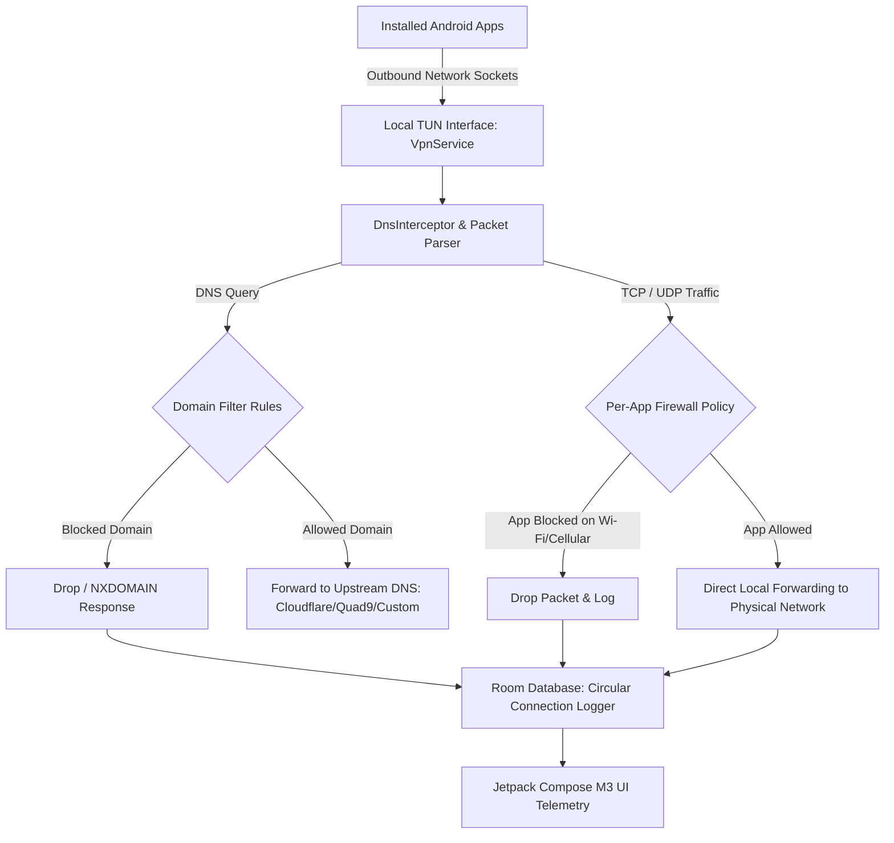

# 🛡️ NetGuardian

<div align="center">


[](https://github.com/memamun/NetGuardian/releases)
[](LICENSE)
[-brightgreen?style=for-the-badge)](https://android-arsenal.com/api?level=26)
[](https://developer.android.com)

**Privacy-First, Zero-Root Local Android Firewall & Real-Time Network Telemetry**

[🌐 Official Website & Documentation](https://memamun.github.io/NetGuardian/) • [📥 Download Latest APK](https://github.com/memamun/NetGuardian/releases/latest) • [🔒 Privacy Policy](https://memamun.github.io/NetGuardian/privacy.html)

</div>

---

## 🌟 Overview

**NetGuardian** is a standalone, open-source Android network security application that puts you in complete control of your device's network traffic. Without requiring root permissions, NetGuardian utilizes Android's local `VpnService` interface to create an on-device virtual network adapter, inspecting, filtering, and logging every outbound socket and DNS request in real time.

All packet filtering and DNS resolutions occur **100% locally on your device**. No telemetry, no remote relay servers, and zero third-party trackers.

---

## ✨ Key Features

- **🛡️ 100% Local, Zero-Root Firewall**: Intercepts IP, TCP, and UDP packets strictly within the local Linux kernel interface on the device.
- **📶 Granular Per-App Controls**: Independently allow or block network access for Wi-Fi and Cellular data per installed application.
- **⚡ DNS Interceptor & Threat Shield**:
  - Configure custom upstream DNS servers (Cloudflare `1.1.1.1`, Quad9 `9.9.9.9`, AdGuard `94.140.14.14`, or custom DNS-over-HTTPS / UDP).
  - Built-in local domain blocking against trackers, telemetry, and phishing.
- **📊 Real-Time Network Telemetry**: Live inspection of remote hostnames, IP addresses, socket ports, protocol types, and byte counters.
- **🎨 Material 3 Expressive UI**:
  - Fully adaptive layout built with Jetpack Compose.
  - Dynamic Color theming, edge-to-edge system bars, and true OLED dark mode.
- **🔒 Quick Settings Tiles**: Instant status toggle tiles (`Firewall`, `Block All`, `Wi-Fi Only`, `Mobile Data`) right in your Android quick settings tray.
- **🚀 Hardened & Battery-Efficient**:
  - Minified with R8 ProGuard rules.
  - Zero persistent wake locks; background services respect Android 14+ foreground service standards.
  - Defensive database migration fallback to eliminate upgrade crashes.

---

## 🏗️ Architecture



---

## 📱 Permissions Transparency

| Permission | Technical Justification |
| :--- | :--- |
| `BIND_VPN_SERVICE` | Required by the Android OS to establish a local virtual network interface (`TUN`) for packet interception. |
| `INTERNET` | Required to route permitted outbound socket connections and perform DNS resolutions to upstream providers. |
| `ACCESS_NETWORK_STATE` | Detects transitions between Wi-Fi, Cellular, and offline states to apply correct per-network rules. |
| `FOREGROUND_SERVICE` | Keeps the local firewall service active while protected in the background. |
| `FOREGROUND_SERVICE_SPECIAL_USE` | Complies with Android 14+ foreground service type declarations for VPN security monitoring. |
| `POST_NOTIFICATIONS` | Required on Android 13+ to display the ongoing firewall active status and quick action controls. |
| `RECEIVE_BOOT_COMPLETED` | Automatically re-activates your firewall protection upon device restart (if enabled in settings). |

> [!NOTE]
> NetGuardian does **NOT** request `REQUEST_IGNORE_BATTERY_OPTIMIZATIONS`, location, contacts, or storage permissions.

---

## 📥 Installation

### Method 1: Direct APK Download (Recommended)
1. Download the latest signed `app-release.apk` from [GitHub Releases](https://github.com/memamun/NetGuardian/releases/latest).
2. Open the downloaded file on your Android device.
3. Tap **Install** (if prompted, allow installation from unknown sources for your browser/file manager).

### Method 2: Via ADB Sideload
```bash
adb install -r app-release.apk
```

---

## 🛠️ Building from Source

### Prerequisites
- **Android Studio Ladybug (2024.2.1+)** or command-line SDK tools
- **JDK 21**
- **Android SDK Platforms**: Compile SDK `36`, Minimum SDK `26` (Android 8.0 Oreo)

### Build Commands
```bash
# Clone the repository
git clone https://github.com/memamun/NetGuardian.git
cd NetGuardian

# Run unit tests
./gradlew testReleaseUnitTest

# Assemble signed Release APK & App Bundle
./gradlew assembleRelease bundleRelease
```

The output artifacts will be placed in:
- `app/build/outputs/apk/release/app-release.apk`
- `app/build/outputs/bundle/release/app-release.aab`

---

## 📄 License

```
Copyright 2026 Mamun Abdullah & NetGuardian Contributors

Licensed under the Apache License, Version 2.0 (the "License");
you may not use this file except in compliance with the License.
You may obtain a copy of the License at

    http://www.apache.org/licenses/LICENSE-2.0

Unless required by applicable law or agreed to in writing, software
distributed under the License is distributed on an "AS IS" BASIS,
WITHOUT WARRANTIES OR CONDITIONS OF ANY KIND, either express or implied.
See the License for the specific language governing permissions and
limitations under the License.
```
